# TurboSETI 1.2.0 Signal Retrieval Characterization
## Background and Motivation
The search for extraterrestrial intelligence in the modern era is in large part
a endeavor in processing the enormous amounts of data collected (commensally or primarily) by global
radio telescope arrays. For that purpose, software suites that can accurately detect candidate ETI transmissions
are vital. The Python/Cython package turboSETI (developed by Emilio Enriquez et al.) is designed to flag
narrowband signals in radio data, and is a primary means of signal detection being employed
by the Breakthrough Listen program. The characterization of signal retrieval as a function of various signal parameters 
of turboSETI is therefore of interest. This work is an extension of the work by Sarah Schultz.
## Methodology
To characterize the performance of turboSETI, artificial signals of a range of signal parameters
are inserted into L-band data collected by the Green Bank Telescope. This survey is limited to fine frequency
resolution data. The files, in filterbank or h5 format, are split into waterfall objects of dimensions 1024 frequency channels and 
complete time channels for ease of processing by Blimpy. The package setigen (developed by Bryan Brzycki), is used for signal insertion. The frame with inserted
signal is saved in filterbank format and processed by turboSETI, whose output file is parsed
for retrieved signal information. 

The characteristics of the inserted signal are distributed across the space of start frequency,
drift, snr, width, separation, and count. Each signal is inserted into the center of a single waterfall frame,
which are separated by 102400 fine frequency channels (approximately 0.3 MHz), in the range of 
1340 MHz - 1926 MHz (starting at the end of the notch filter to the end of the file). Inserted signals
are distributed linearly in start frequency, and are distributed in drift, width, and snr in ranges of
-10 to 10 Hz/s, 10 to 200 Hz, and 10 to 50 respectively. Furthermore, frame size and number of inserted signals
is also varied from 1024 to 10240 and 1 to 2 respectively, with secondary inserted signals
playing the role of RFI (having randomized start frequency and bounded randomized drift rate,
with identical width). 

TurboSETI parameters are set to search for signals with SNR of higher than
15 and drift of magnitude less than 5 Hz/s. Signal retrieval is classified a success if turboSETI indicates 
the presence of a signal within the frame (this is appropriate as we desire that turboSETI captures
all instances of signal presence, regardless of signal parameters; a high instance of positives is
preferable greatly to a false negative). Details about each trial 
run are included in further detail in the relevant sections below.

Insertions were done in the file /mnt_blpd7/datax/hard_linked_in_dl/gbl/spliced_blc0001020304050607_guppi_57557_47744_HIP3092_0005.gpuspec.0000.h5
located on blpc0.
## Results
#### Base Signal Search:
To ensure that results are interpreted with correct context, information
about the signals present in the original file is necessary. TurboSETI is therefore
run on the entirety of the frequency range without signal insertion. Frame size here is 
1024 frequency channels.

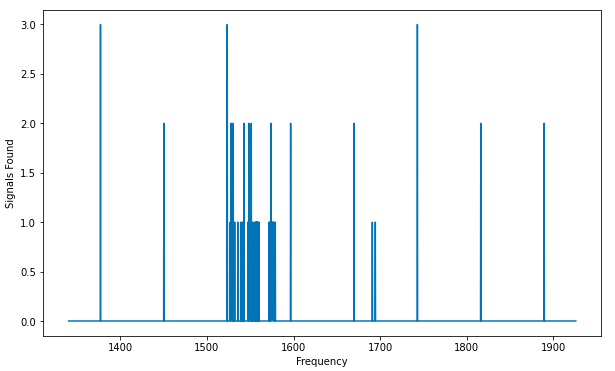

A total of 70 signals were found across the entire frequency range. Note that the frequency range of 1500-1600 MHz has the maximum amount of RFI.
The effects of this RFI on signal retrieval parameters will be quantized in this report. For reference, the waterfall plot of the range is as below:

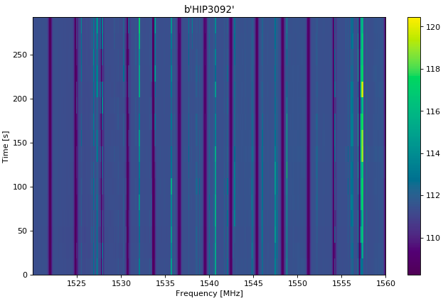

### Single Insertion:
#### Insertion Frequency vs Percent Recovered
Signal insertion parameters are at drift: 0 Hz/s, SNR: 40, width: 40 Hz
at the specified frequency interval of 102400 frequency channels per insertion,
corresponding to a total of 2050 inserted signals. For this analysis, discovery corresponds to 
any positive recovery, regardless of number discovered (refer to the
data files if number recovered is of interest).

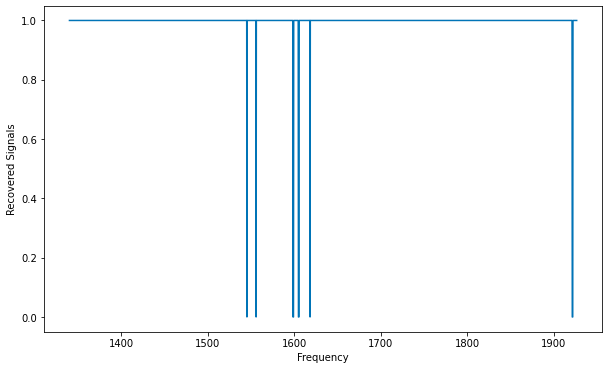

A total of 12 frames reported no signal recovery by turboSETI, corresponding
to a signal recovery rate of 99.4%. The dropped signals cluster around the 
frequency range of 1550 MHz - 1600 MHz, where it was observed that RFI was 
notably high. Broadband RFI might be the cause for the loss of the signal, 
as frame noise might be confounding turboSETI retrieval.

#### Inserted Frequency vs Recovered Frequency
For identical signal insertion parameters as above, the recovered frequency
of turboSETI vs inserted frequency for the signals that were retrieved are as 
follows:

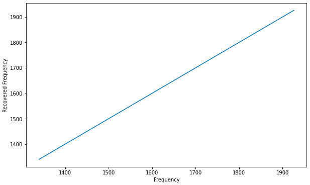

A linear and one-to-one correspondence is seen, as expected.

#### Inserted Drift vs Recovered Drift 
Drift insertion is done through a range of -10 Hz/s to 10 Hz/s across each
of the frequency frames in order. TurboSETI was set to search for signals
with magnitude of drift in the range of -5 Hz/s to 5 Hz/s.

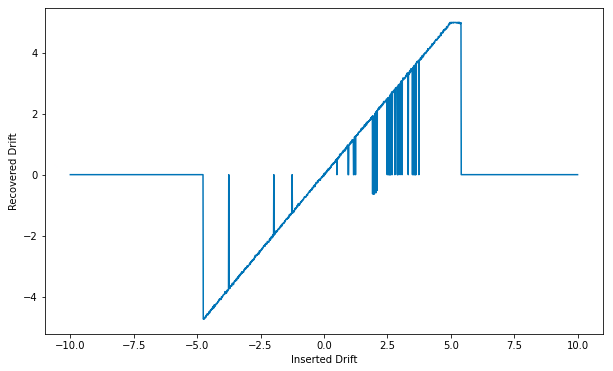

The edge drifts are not captured as expected as turboSETI's search range was limited. Note that no signal detection 
corresponds to a drift value of 0 Hz/s.  The lack of signal recovery is visible
in the range of 0 to 2.5 Hz/s, which due to the insertion scheme following the 
frequency progression of inputted frames, is at the region of high noise and spurious detection
noted in the first plot. Interestingly, drift values where secondary signals are
present are sometimes very incorrect, with negative results returned by turboSETI. 
This might be in part due to the fact that the captured secondary noise signals largely
had very small drift rates (very near 0), which means the composite signal turboSETI
detected appeared to drift very little.

Note the edge values, where signals with more negative drifts than the search bound
are ignored, while those with more positive values are classified as having drift of 5 Hz/s
for a larger range. This might have to do with tuboSETI/setigen drift calculation difference, as is 
explored further in the next section.

#### Drift vs Percent Recovered

The above plot parameters are pictured with percent of signals captured. Excluding
spurious noise detections and drops, the plot appears as expected. Something interesting to
note though is that the drift at which signal detection starts is a little shifted from the 
inserted range, meaning turboSETI drift calculation might differ from setigen's (perhaps
using left/right boundary convention for the signal, which should yield with this
signal thickness and frame size a difference of about 0.05 Hz, which is a little smaller
than the visible error).

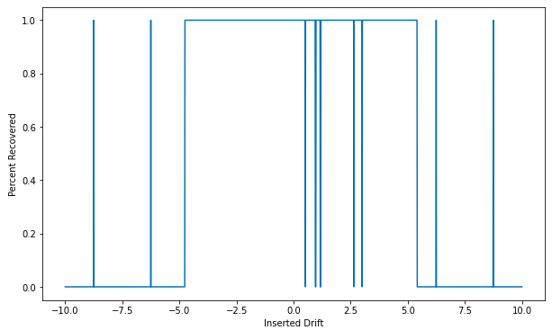

#### SNR vs Percent Recovered

The SNR was varied linearly from 0 - 100 to yield the plot below. Signals with 
SNR of less than around 6 were rejected altogether, while those in the range of 6-15
were rejected or detected with some nonzero probability. However, since turboSETI
parameters were set to detect signals with SNR of higher than 15, behavior outside
of this range can be expected to be undefined. 

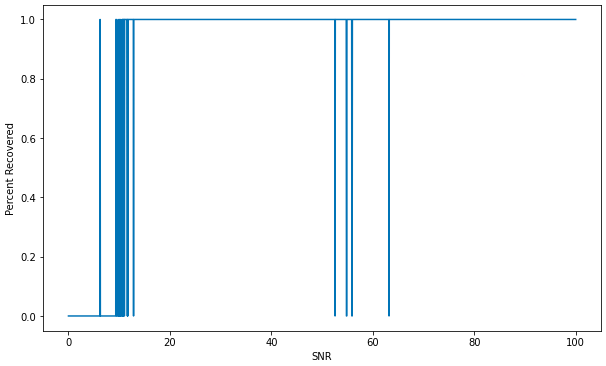

Again, note the signal drops at the midrange, corresponding to signal insertion
in the noisy section of the data, not due to SNR values.

#### Inserted SNR vs Recovered SNR 

As discussed above, SNR values below 15 display undefined behavior, which is to be
expected. However, note that the SNR values in the region of high signal noise vary wildly from
the inserted value. This is due to the fact that the primary candidate reported by
turboSETI was a signal existing in the inserted frame; RFI from the source data. Note that
the plot below is generated for instances when only one signal was detected, meaning that
the inserted signal in the noisy range was not detected at all.  

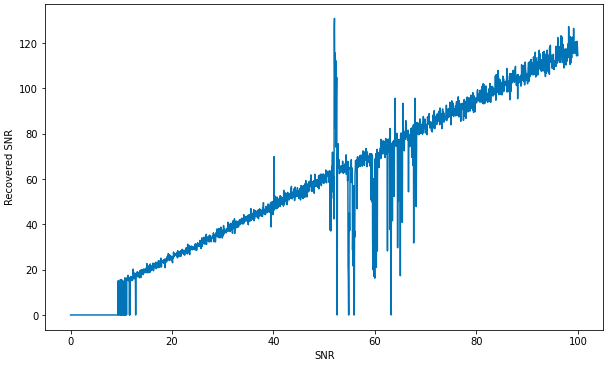

Note the offset in the recovered vs inserted signal SNR, which was reported by the 
study conducted by Sarah Schultz.

#### Signal Width vs Percent Recovered

Signals of width smaller than around 1.7 Hz were not detected by turboSETI, as expected. Also,
signals of widths of larger than around 150 Hz were also not detected, with undefined behavior
in the range. TurboSETI is designed to be a narrow-band signal detector, and at this frame size, the inserted
signal is around 5% of the frame size, which means that undefined behavior might be warranted.

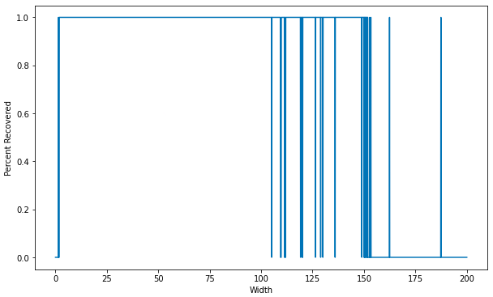

Note that signal drops in the noisy range, and later spurious detection are again artifacts of the insertion scheme, and not due to the 
width.

### Double Insertion:

In the following sections, two signals are inserted per frame. One signal is the "primary," with
the higher SNR value, while the "secondary" has a lower SNR value. In environments where narrow-band, 
high contrast RFI could exist, characterising the performance of turboSETI when multiple signals are present
in close proximity is essential. Secondary signal insertion is done stochastically,
with center frequency randomized to somewhere within the frame, and drift rate to be
within a bounded range of magnitude 5 Hz/s. SNR is assigned to be 50% of the primary signal SNR except for 
the SNR ratio plot generation. All widths are selected to be 40 Hz.

#### Signal Separation vs Percent Recovered
The secondary signal is inserted at a random location within the frame, and the percent of signals
captured as a function of those recovered is reported for each insertion separation. This is conducted
to find at turboSETI's signal resolution, i.e. at what frequency two signals are reported as one. In this case, 
frame size was expanded to 5120 channels to explore a greater range of separations (of magnitude
7.5 kHz). The values were binned in integer range (-8 to -7, -7 to -6, etc), and
average percent recovered as a function of separation is shown below.

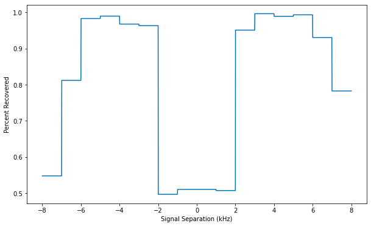

The plot is normalized with two, since two signals are inserted; note the range on the y-axis 0f
between 0.5 and 1. Considering the range of drift values of the inserted signals, the maximum frequency that a single signal
can cross over the time span of the frame is 1.460 kHz. Thus, the separation of around 2 kHz that the plot
shows that turboSETI requires is logical, as a signal separation of less has a high probability of signal
crossing. Furthermore, the falling off of capture rates towards the end of the frame is 
likely due to the signal having a higher probability of leaving the frame. 

Finally, note that the slight increase in signal capture of the central bin is likely an artifact
of the increased noise in the center of the frequency range, meaning that preexisting noise signals
were considered successful secondary signal detections.
 
#### SNR Ratio vs Percent Recovered
Number of signals detected as a function of secondary to primary SNR ratio is found for SNR ratio
0.0-0.9. In this case, frame size was expanded to 5120 channels
so that signal resolution would not become an issue. Since SNR range is discretized,
statistics are collected over n = 205 signal insertions per SNR value with randomized signal separation
and drift.

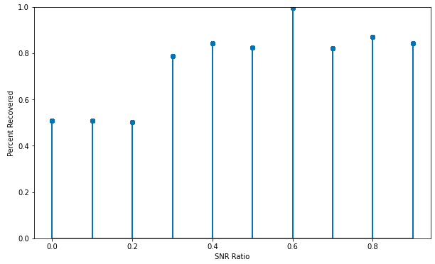

The plot was again normalized with two, meaning that a stem at 0.5 indicates one of the two inserted
signals were recovered. As expected, low SNR ratio yields only the primary signal. Again, the peak
at SNR 0.6 is likely due to noise signals in the source file being reported as secondary signal detection.
The convergence to an average of around 80% reflects the value one would expect considering the separation 
vs percent recovered plot, which averages over its range a value of around 75%. The converging value therefore
shows that higher SNR secondary signals are similarly distributed to the recovery 
histogram from above, with SNR ratio of 50%.

## Conclusion

TurboSETI function very well as a detector of narrow-band signals in fine-resolution frequency
data. The captured signal rate of 99.4% across regions of very high noise and RFI that
contains candidates for secondary detection is notable. The code behaves in a defined and
desired manner in the range of specifications it is set to run at. While recovered parameters are often
mutated by the introduction of interference, the flagging of the signal for further review, being the
primary purpose of the code, is largely fulfilled. 

## Future Work
Drift, width, SNR, and SNR ratio percent capture results would ideally be done stochastically in bounded ranges,
with histograms yielding percent capture results to avoid correlation with insertion 
frequency (and the corresponding noise distribution). Further quantification of the correlation of signal separation and 
drift with percent recovered are warranted, as the overall signal separation is a function of start
separation and drift. However, in this study drift rates are small over a time period on the scale of minutes,
so crossing in the 5120 frame size is of reduced likelihood outside of around 1000 kHz separation. Reduction of noise in the final output using
post-processing with the zero-insertion data or frequency/drift insertion/recovery correlation is also
very necessary. Finally, insertion on a larger sample of example data and in other bands is a logical next step.

### Usage of SignalInsertion.py
The path to the input file, number of frequency channels per frame, range of frequency (with none being
the maximal value for that range definition), and frequency shift are set before the call
to the waterfall iterator generator. The function turbo_runner takes the generated
iterator along with a series of optional parameters which are all arrays or constants specifying the
primary drift, snr, and width and the secondary number of signals and snr ratio, as well as the
turboSETI search parameters. The noise_parameter function also takes in an option called
near which generates random parameters such that the secondary signal is within range to cross
the primary. Note that the behavior of the code is only ensured to be stable with fine-resolution
input files.
